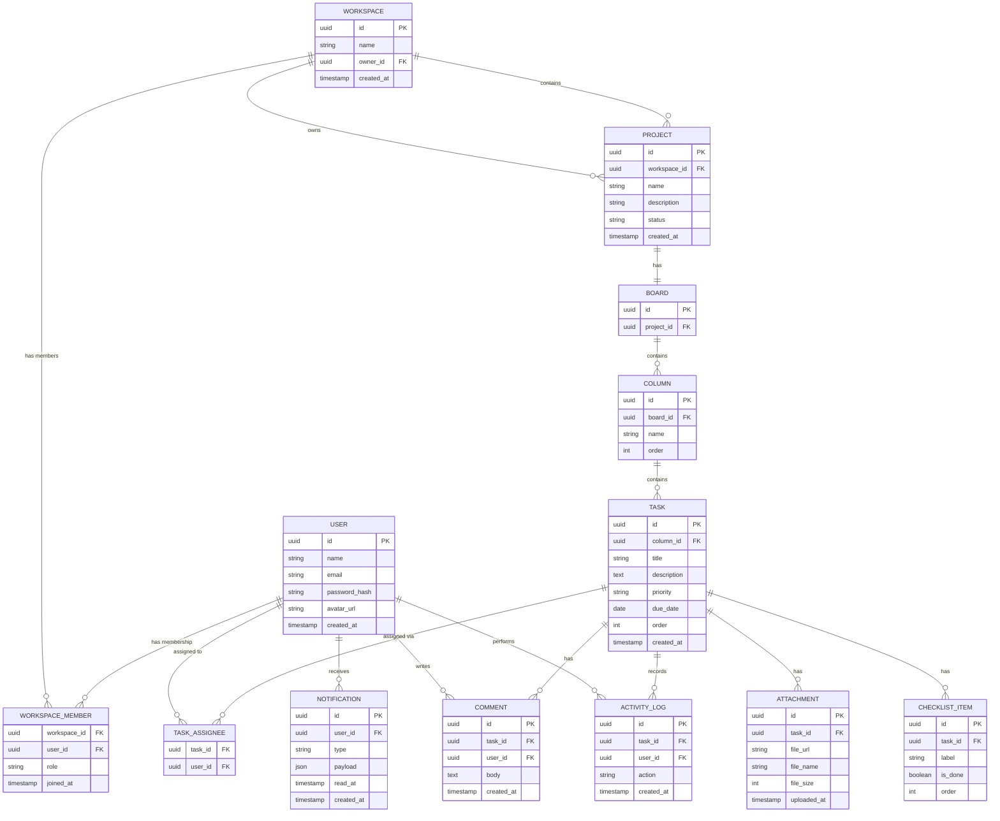

# TaskFlow — Entity-Relationship Diagram

## 1. ER Diagram

## 2. Relationship Notes

| Relationship | Cardinality | Notes |
|---|---|---|
| User ↔ Workspace | Many-to-many (via WORKSPACE_MEMBER) | A user can belong to multiple workspaces; a workspace has multiple members, each with a role |
| Workspace → Project | One-to-many | A project belongs to exactly one workspace |
| Project → Board | One-to-one | v1 supports a single board per project |
| Board → Column | One-to-many | Ordered via `order` field |
| Column → Task | One-to-many | Ordered via `order` field within column |
| Task ↔ User (assignee) | Many-to-many (via TASK_ASSIGNEE) | Supports multiple assignees per task |
| Task → Comment | One-to-many | Comments are not nested/threaded at the DB level in v1 (flat list ordered by created_at); UI may group visually |
| Task → Attachment | One-to-many | Files stored in S3-compatible storage; row stores metadata + URL |
| Task → Checklist Item | One-to-many | Simple ordered sub-items with boolean completion |
| Task → Activity Log | One-to-many | Append-only audit trail |
| User → Notification | One-to-many | Read/unread tracked via `read_at` nullable timestamp |

## 3. Indexing Recommendations
- `WORKSPACE_MEMBER(workspace_id, user_id)` — composite unique index (membership lookup + prevents duplicates)
- `TASK(column_id, order)` — supports fast ordered board rendering
- `COMMENT(task_id, created_at)` — supports fast thread loading
- `NOTIFICATION(user_id, read_at)` — supports fast "unread count" queries
- `PROJECT(workspace_id, status)` — supports fast active/archived filtering

## 4. Normalization Notes
Schema is normalized to 3NF. `TASK_ASSIGNEE` and `WORKSPACE_MEMBER` are junction tables resolving the two many-to-many relationships in the system (user↔task, user↔workspace). No denormalized counters are stored in v1; aggregate values (e.g., "3/5 checklist complete") are computed at read time — revisit if analytics query load requires materialized counts.
