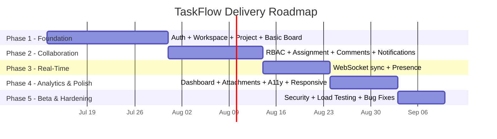

# TaskFlow — Project Roadmap

*Assumes a small team of 2–4 developers working part-time. Adjust durations to your actual team size and availability.*

---

## Phase 1 — Foundation (2–3 weeks)
**Goal:** A user can sign up, create a workspace/project, and use a basic (non-real-time) Kanban board.

- Auth: signup, login, email verification, password reset, JWT sessions
- Workspace CRUD + membership model
- Project CRUD
- Basic Kanban board: default columns, create/move/delete tasks (via API, refresh-based, no live sync yet)
- Core data model + database schema in place

**Exit criteria:** A single user can register, create a workspace and project, and manage a board end-to-end.

---

## Phase 2 — Collaboration (2 weeks)
**Goal:** Multiple people can work in the same workspace with appropriate permissions.

- Invite flow (email + shareable link)
- RBAC: Admin / Member / Viewer roles enforced server-side
- Task assignment, due dates, priority, labels, checklist
- Threaded comments with @mentions
- In-app notifications (assignment, mention, due-date reminders)

**Exit criteria:** A team of 3+ can be invited into a workspace, assign work to each other, and comment on tasks with correct permission boundaries.

---

## Phase 3 — Real-Time (1–2 weeks)
**Goal:** The board feels alive — changes appear instantly for everyone.

- WebSocket gateway + Redis pub/sub wiring
- Live propagation of task moves, edits, and new comments
- Presence indicators
- Optimistic UI with conflict resolution
- Polling fallback if WebSocket connection drops

**Exit criteria:** Two browser sessions viewing the same board see each other's changes within ~1 second without refreshing.

---

## Phase 4 — Analytics & Polish (1–2 weeks)
**Goal:** Teams can see how they're doing, and the product feels solid to use.

- Analytics dashboard: status breakdown, overdue list, per-member workload, completion trend
- File attachments on tasks
- Accessibility pass (WCAG 2.1 AA on core flows, keyboard navigation)
- Responsive QA across mobile/tablet/desktop widths

**Exit criteria:** Admins can view meaningful project analytics; core flows pass an accessibility and responsiveness review.

---

## Phase 5 — Beta & Hardening (1 week)
**Goal:** Ready for real teams to rely on it.

- Security review (OWASP Top 10 pass, rate limiting, input sanitization audit)
- Load testing against target scale (100 members / 50 projects per workspace)
- Bug fixes from internal beta feedback
- Backup/restore procedure verified

**Exit criteria:** No open Critical/High severity defects; security and load targets met; ready for external beta users.

---

## Timeline Overview

## Post-v1 Candidates (Backlog)
- Native mobile apps
- Third-party integrations (Slack, GitHub, Google Calendar)
- Time tracking / billing
- Gantt / resource-leveling views
- Multi-language support
- Two-factor authentication
- CSV/PDF analytics export
