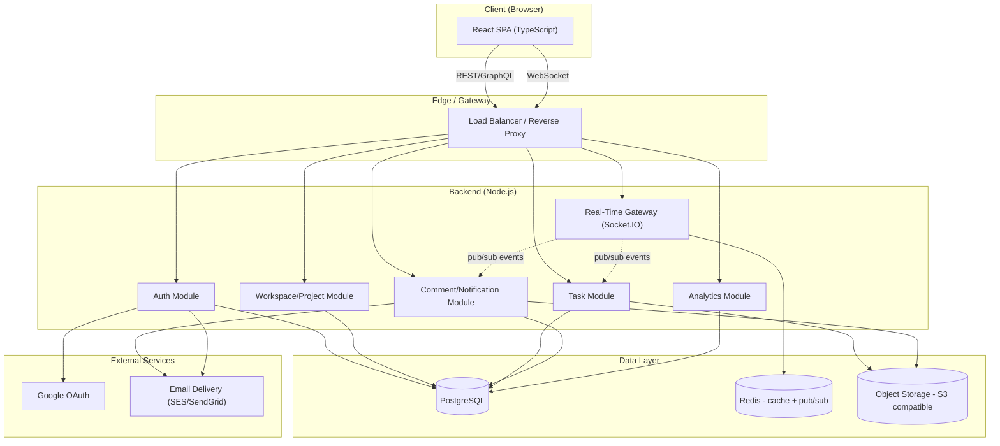
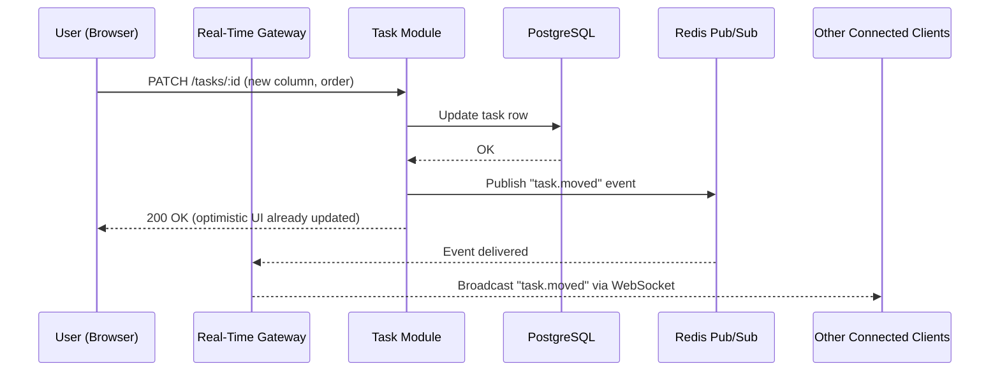

# TaskFlow — System Architecture

## 1. Architecture Style
TaskFlow follows a **modular monolith** approach for v1: a single deployable backend service organized into clearly separated domain modules (Auth, Workspace, Task, Notification, Analytics). This keeps operational complexity low for a small team while preserving clean boundaries that could later be split into microservices if scale demands it.

## 2. High-Level Component Diagram

## 3. Module Responsibilities

| Module | Responsibility |
|---|---|
| **Auth Module** | Signup/login, OAuth, JWT issuance/refresh, password reset |
| **Workspace/Project Module** | Workspace & project CRUD, membership, invites, RBAC enforcement |
| **Task Module** | Board/column/task CRUD, assignment, checklist, attachments, activity log |
| **Comment/Notification Module** | Threaded comments, @mentions, in-app + email notifications |
| **Analytics Module** | Aggregation queries for dashboard (status counts, workload, trends) |
| **Real-Time Gateway** | WebSocket connections, presence, broadcasting board/task/comment events via Redis pub/sub |

## 4. Request Flow Example: Moving a Task Card

## 5. Scaling Considerations
- The Real-Time Gateway is stateless with respect to application logic; horizontal scaling is achieved by adding gateway instances that all subscribe to the same Redis pub/sub channels.
- PostgreSQL read replicas can be introduced for the Analytics Module if aggregation queries become a bottleneck.
- Object storage (S3-compatible) is decoupled from the application servers, so attachment growth does not affect compute scaling.

## 6. Deployment View (Suggested for v1)

| Component | Suggested Hosting |
|---|---|
| Frontend (React SPA) | Vercel / Netlify |
| Backend (Node.js modules + Real-Time Gateway) | Render / Railway / AWS ECS |
| PostgreSQL | Managed Postgres (RDS / Supabase / Neon) |
| Redis | Managed Redis (Upstash / ElastiCache) |
| Object Storage | AWS S3 or S3-compatible (Cloudflare R2) |
| Email Delivery | SES / SendGrid |

## 7. Security Boundaries
- All client-server traffic over HTTPS.
- RBAC checks execute inside each module before any DB write — never trusted from client input alone.
- JWT verified at the API gateway layer before requests reach domain modules.
- Redis pub/sub channel names are scoped per-workspace/project to prevent cross-tenant event leakage.
